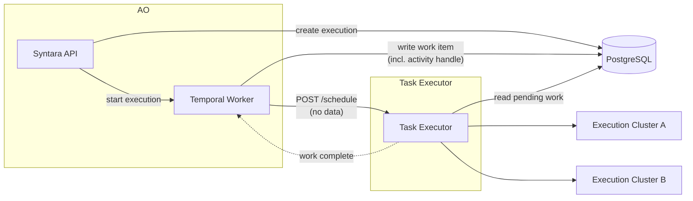
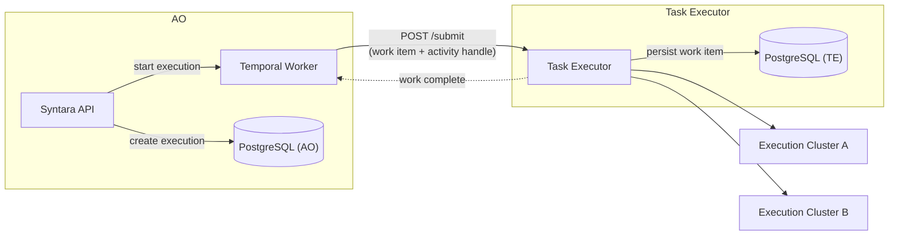
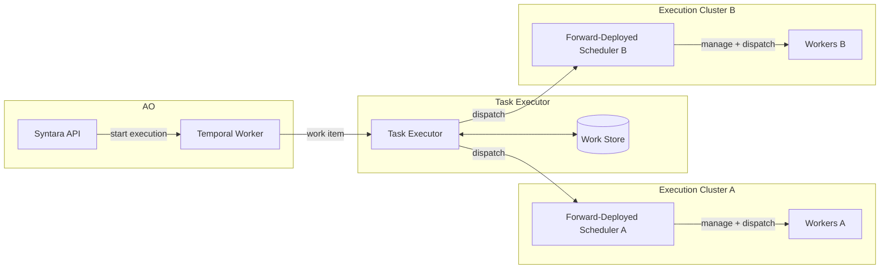
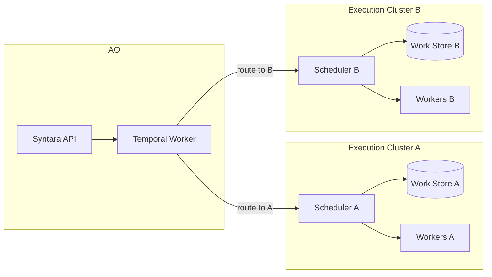

# Execution Plane — Key Design Decisions

[AAP-90685](https://redhat.atlassian.net/browse/AAP-90685) · Parent: [ANSTRAT-1803](https://redhat.atlassian.net/browse/ANSTRAT-1803)

Key architectural options — either still live, or designated as formally closed in this document. For implementation requirements see [execution-plane.md](execution-plane.md).

Each section states the options, the current working position, and what would change that position.

---

## D1: Scheduler topology

### Centralized Scheduler — nearly finalized

One Task Executor deployment holds the Work Store and owns all scheduling decisions: affinity routing, cross-cluster capacity balancing, back-pressure, and result persistence. The Task Executor is a separate service from Syntara API and Temporal Worker. Execution Clusters receive dispatch calls but do not make scheduling decisions.

**Drawback:** Some backends (e.g. podman warm containers) would require the Task Executor to manage worker pool lifecycle directly, duplicating what OpenShell already does. We are not interested in those backends. The planned mitigation is a custom-service backend type — the TE dispatches to an operator-provided service that owns its own worker management (to be documented separately).

#### D1.1: Shared vs. split PostgreSQL

Note: "separate database" here means a separate PostgreSQL *instance* — not just a separate schema. Both sub-options below isolate TE tables in an `execution_plane` schema; the question is whether that schema lives on the same instance as Syntara.

**D1.1.a — Shared instance**

TE tables live in the `execution_plane` schema on the same PostgreSQL instance as Syntara. Temporal Worker writes the work item to `execution_plane.work_items` before calling `POST /schedule`. `/schedule` carries no data — it is a pure wakeup. TE polls the shared database for pending work.

See the implementation stub: [AlanCoding:execution-plane-lib](https://github.com/syntara-orchestration/syntara/compare/devel...AlanCoding:execution-plane-lib?expand=1)

Syntara API can also read `execution_plane.*` tables directly for the admin UI — no extra API hop.

**D1.1.b — Separate TE database**

TE has its own PostgreSQL instance. Temporal Worker cannot write to it directly. The work item must travel to TE via its API before TE can persist it. `POST /schedule` must carry the work item payload (or a separate `POST /submit` endpoint must exist). This changes the handoff protocol.

**Note on PostgreSQL database vs. schema vs. instance.** Within one PostgreSQL *instance*, `public` and `execution_plane` are separate *schemas* inside the same *database* — one connection string reaches both, and cross-schema SQL joins work. D1.1.b means a separate PostgreSQL *database* (different connection string), regardless of whether it is on the same server or a different one. PostgreSQL does not support cross-database SQL joins natively.

**Impact on the shared web service.** AO and TE admin routes are expected to be served by the same FastAPI application. If TE has its own database, that application process must connect to both. This means two `AsyncEngine` instances, two connection pools, two session factories, and two sets of credentials in configuration. Connection count per web worker roughly doubles (or grows by however large the TE pool is configured). Cross-resource queries that join `public.*` and `execution_plane.*` in a single SQL statement are no longer possible — the application layer must issue two queries and merge in Python.

**Impact on package structure.** A single web service entrypoint needs to import from both `syntara` and `execution_plane` and initialize both engines at startup. Either the `syntara` package imports `execution_plane` directly (coupling the packages), or a third entrypoint package assembles both. D1.1.a avoids this entirely — one engine, one session, `syntara` imports `execution_plane` models through the same connection.

**Working position:** D1.1.a. D1.1.b reintroduces a data-in-the-HTTP-call design that complicates idempotency and recovery. Shared instance with schema separation gives strong isolation without the protocol change. AWX (and any other consumer) accesses execution plane data via the TE API, not at the database level — there is no known requirement that would force D1.1.b.

### Centralized + Forward-Deployed Scheduler — contingent on worker management

A forward-deployed scheduler is a scheduling component that runs inside the remote execution cluster, co-located with workers. In this topology the central TE still owns the Work Store and all cross-cluster capacity decisions — there is no replication of scheduling state at the cluster level. The forward-deployed component is an execution proxy, not an autonomous scheduler: it handles only the local operations that are awkward to drive remotely.

**The worker management problem.** The central TE's WorkerManager is designed as a swappable backend type (Vanilla K8S, OpenShell, custom service). This works cleanly when the TE can drive worker lifecycle over a well-defined protocol. The problem arises when worker management requires sustained local operation — warm pool maintenance, node health monitoring, preemption, local readiness decisions — that does not fit the stateless request/response model of a backend type. In that case, something has to live in the cluster and act autonomously, and the TE becomes a dispatcher to that thing rather than a direct manager of workers.

**Relationship to the custom-service backend type.** The current plan handles this via a custom-service backend — an operator-provided service that owns its own worker lifecycle, which the TE dispatches to. If that approach is sufficient, the forward-deployed component is just an external service and this topology is not needed as a first-class concept. The combined topology becomes relevant only if the custom-service model is insufficient and we need to formally introduce a co-deployed component with its own lifecycle in Syntara.

**Status:** Not accepted, not rejected. This topology may be forced by future requirements. The distinction from the rejected Temporal-to-Distributed option is that the Work Store and capacity decisions remain in the central TE — the forward-deployed component has no scheduling autonomy.

### Rejected: Temporal-to-Distributed Schedulers

AO requires a whole-service back-pressure queue — a durable Work Store that tracks capacity and queued work across all Execution Clusters. Temporal is a workflow engine; it is not the right abstraction for managing dispatch queues. In this rejected topology, Temporal would route directly to per-cluster forward-deployed schedulers, becoming the de facto back-pressure mechanism with no single owner for cross-cluster capacity decisions.

Problem: each cluster has its own Work Store with no cross-cluster capacity view. Temporal's task routing cannot substitute for a central back-pressure queue. **This is rejected.**

---

## D2: OpenShell installation — who owns it?

**Question:** Does Syntara install and manage OpenShell, or does the operator install OpenShell independently and connect it to Syntara?

**Option A — Operator installs OpenShell (current position)**

OpenShell is installed by the platform operator as a day-2 operation (OLM, Helm, or manual). Syntara registers an Execution Target pointing at the OpenShell gRPC endpoint. Syntara does not manage the OpenShell lifecycle.

**Option B — In-app OpenShell provisioning**

Syntara's UI includes an "Install OpenShell" flow that drives installation onto a registered cluster. Syntara owns the OpenShell lifecycle.

**Working position:** Option A. In-app installation is installer-scale work (OLM integration, cluster admin privilege escalation, upgrade coordination) that is out of scope for Phase 2. Registering an already-installed OpenShell as an Execution Target is workable with no installer changes.

**PM question:** Is there a customer expectation that the AO installer handles OpenShell installation, or is day-2 manual connection acceptable?

---

## D3: OpenShell rollout — cold sandboxes before warm pools

**Question:** Should Phase 2 implement warm pools from the start, or prove OpenShell API compatibility with cold sandboxes first?

**Option A — Cold sandboxes first (current position)**

Phase 2 uses `CreateSandbox` + `ExecSandbox` per task. Each task incurs sandbox startup latency. No `SandboxWorkloadTemplate` or warm pool configuration required.

Rationale: Cold sandboxes exercise the full OpenShell dispatch path (gRPC stream, exit code handling, credential injection) with minimal moving parts. Warm pools add template lifecycle, readiness waiting, and `--max-burst` configuration complexity. Once cold dispatch works, warm pools are an additive change to the provisioning step.

**Option B — Warm pools from day one**

Implement `SandboxWorkloadTemplate` + `ClaimSandbox` in Phase 2. Accepts the additional complexity in exchange for acceptable latency from the start.

**Working position:** Option A. Startup latency is a performance issue, not a correctness issue. Proving the dispatch path is more valuable than optimizing it before it exists.

**PM question:** Is startup latency for OpenShell cold sandboxes acceptable for Phase 2, or is warm-pool performance a launch requirement?

---

## D4: Container image management — user-driven vs. operator-configured

**Question:** Can a user register a new worker container image through the Syntara UI, and does that trigger pool bootstrapping?

**Option A — User-driven image registration**

The UI has a "Containers" tab where users (or operators) add OCI image references. Syntara handles pool bootstrapping when a new Container is registered. This implies Syntara owns the worker Deployment lifecycle and can create new pools on demand.

**Option B — Operator-configured (current position)**

Built-in container images ship with AO and are pre-registered. Custom images are registered by operators through configuration or API, not through a self-service UI flow. The UI shows registered Containers but does not expose a create/import flow to end users.

**Working position:** Option B for MVP. Option A requires Syntara to manage image pull secrets, Deployment rollout, and pool readiness — significant scope. Custom images are an operator concern.

**PM question:** Is there a customer use case where a non-operator user needs to register a custom container image at runtime without operator involvement?

---

## D5: Remote cluster scope — Phase 3 boundary

**Question:** Is multi-cluster execution (targets on remote OpenShift clusters or RHEL) in scope for Phase 1/2, or is it Phase 3?

**Current position:** Phase 1 and 2 are on-cluster only (Syntara and workers on the same cluster). Remote clusters are ANSTRAT-2337 scope.

**What's in scope at each phase:**

| Phase | Topology |
|---|---|
| 1 (MVP) | On-cluster vanilla K8S only |
| 2 | On-cluster OpenShell (cold sandboxes) |
| 3 | Warm pools; remote clusters via Pool Agent or OpenShell; installer integration TBD |

**PM question:** Do customers expect to register remote clusters from day one (Phase 1), or is on-cluster MVP sufficient for initial release?

---

## Web service architecture

### Options for serving AO and TE routes from one process

Both AO and TE admin routes are expected to be served by the same FastAPI application. Two packaging approaches are viable.

**Option A — AO depends on execution_plane as a Python package**

The `syntara` package lists `execution_plane` as a dependency. At startup, `api/main.py` calls `app.include_router(execution_plane.router, prefix="/api/v1/execution")`. One `AsyncEngine`, one session factory, one `get_db` dependency — no changes to the existing database wiring. This is only compatible with D1.1.a (shared database); separate databases would require two engines in the same process.

This is the least disruptive path: existing routing, session management, and middleware are all unchanged. The `execution_plane` package is just another domain added to the app.

**Option B — Separate web entrypoint package**

A third package (e.g., `syntara-web`) imports from both `syntara` and `execution_plane` and assembles the combined app. Neither domain package knows about the other. The entrypoint wires both sets of routers, both engines (if D1.1.b), and any shared middleware.

This is compatible with D1.1.a or D1.1.b. It enforces a strict package boundary — `syntara` and `execution_plane` have no import dependency on each other. The cost is that `api/main.py` in `syntara` ceases to be a runnable entrypoint and becomes a library. All deployment config, startup hooks, lifespan handlers, and middleware registration move to the new package. That is a real disruption to the existing codebase.

**Working position:** Option A with D1.1.a. Option B is only justified if strict package separation is a hard requirement, which it is not when the database is shared.

### RBAC wiring for TE routes

The existing OPA system uses string-based resource types — `PermissionChecker("execution_target", "read")` — with no Python class references in the policy registry. `build_resource_actions` auto-discovers TE resource types at startup by introspecting included routes. No manual registration is needed.

Adding TE built-in policies means adding `PolicyInfo("execution_target", "read", ...)` entries to `BUILTIN_POLICIES` in `role_conventions.py`. These are plain string tuples; no import from `execution_plane` is required.

The one potential AO→TE import: `PermissionChecker` accepts an optional `resource_model` argument used to look up `project_id` and labels for project-scoped checks. If TE routes pass `resource_model=ExecutionTarget`, that imports from `execution_plane` at route registration time. This is avoided if TE resources are not project-scoped — `ExecutionTarget` has no `project_id` in the current design, so this import does not arise.

---

## AWX Integration

### The Task Executor as an API for AWX

AWX (Automation Controller) would use the Task Executor as an external API for dispatching execution work, rather than managing execution inline as it does today. AWX becomes a consumer of the TE's dispatch interface, the same role AO's Temporal Worker plays. This is analogous to how AAP 2.5 externalized authentication into a shared service — here, execution is the shared concern being externalized.

### Model morphism — open question

AWX has two relevant models: `InstanceGroup` (a logical grouping of nodes, used for job routing) and `Instance` (a physical execution node with capacity).

Two possible mappings, both under consideration:

| AWX model | Mapping option 1 | Mapping option 2 |
|---|---|---|
| InstanceGroup | → ExecutionTarget | → affinity label on ExecutionTarget |
| Instance | → (no direct equivalent) | → ExecutionTarget |

Option 1 treats an InstanceGroup as a pool (ExecutionTarget = a cluster or gateway). Option 2 treats individual nodes as targets and makes InstanceGroup a routing label. The right answer depends on the granularity at which AWX currently routes jobs and whether that maps to cluster-level or node-level targeting. This needs to be resolved before AWX integration can be designed.

### Compatibility and phased introduction

This is not backward API compatible. AWX's job dispatch today goes through the existing execution node mesh (receptor/workceptor). The TE is a different dispatch path.

Phased introduction is possible: some job types in Controller use the old mesh, others use the TE API. This allows incremental migration without a flag-day cutover, but requires Controller to maintain both paths during the transition.

### Changes required in Controller

- **DependencyManager**: unchanged — dependency resolution is independent of dispatch.
- **TaskManager**: split. The portion that manages job-to-node assignment moves toward the TE (affinity routing, capacity), but Controller retains blocking rules (e.g. only one job running for a single-JT at a time).
- **InstanceGroup and related models**: transferred to the TE service; Controller references them via TE API rather than local DB.
- **workceptor**: effectively unused — the TE dispatch path does not use receptor.
- **ExecutionEnvironment**: selected in Controller independently of InstanceGroup today. This is incompatible with the TE model, where the ExecutionProfile couples container image and placement. Resolution is needed — either EE selection moves into the TE, or the TE's ExecutionProfile model is made flexible enough to decouple image from placement.

### RBAC incompatibility — hard constraint

Syntara uses OPA (Open Policy Agent) with Rego policies evaluated against Syntara's user and resource model. AWX has its own RBAC system built on Django's permission layer, with roles (admin, auditor, use, execute) scoped per resource. These are not compatible. A shared TE cannot evaluate both simultaneously.

The only workable boundary is **service-to-service authentication** at the TE: the TE treats AO and AWX as trusted system-level callers and does not evaluate end-user RBAC itself. Each calling system is responsible for authorizing the operation before calling the TE. The TE authenticates the caller as a known system (mTLS, signed JWT, or API key) and dispatches the work.

This resolves the RBAC mismatch but creates three downstream requirements:

- **Tenant isolation in the Work Store.** If AO and AWX share a TE, their work items live in the same `execution_plane` schema. A `tenant` column (or equivalent namespace) is required to scope all queries and prevent cross-tenant visibility.
- **Caller-asserted user context for audit.** The TE cannot independently determine who initiated a job. Each work item must carry a caller-provided user identifier so audit logs are meaningful. The TE trusts the caller's assertion.
- **Capacity accounting per tenant.** If AO and AWX share execution capacity, some model for per-tenant quotas or priority is needed. This has no natural home in the current TE design.

These requirements make a shared TE significantly more complex than a dedicated one. A dedicated TE per product (AO's TE and AWX's TE separately) avoids all three, at the cost of duplicated infrastructure.

---

## PM Feed-In Questions

These require PM input to resolve — engineering cannot answer them from architecture alone.

| # | Question | Why it matters |
|---|---|---|
| PM-1 | Is on-cluster-only MVP sufficient, or do customers expect remote clusters on day 1? | Determines Phase 1 scope and Pool Agent priority |
| PM-2 | Does AO need to install OpenShell, or is operator day-2 connection acceptable? | Determines whether installer-scope work is needed for Phase 2 |
| PM-3 | Is there a use case where non-operators register custom container images at runtime? | Determines whether self-service image registration is in scope |
| PM-4 | What customer data is available on which workflow activity types are most used? | Drives prioritization of which worker containers ship first |
| PM-5 | Is startup latency for OpenShell cold sandboxes acceptable for Phase 2, or is warm-pool performance a launch requirement? | Determines whether warm pools must be in Phase 2 |
