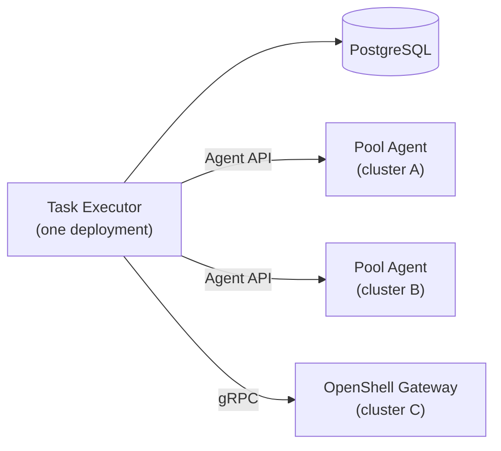

# Execution Plane — Key Design Decisions

[AAP-90685](https://redhat.atlassian.net/browse/AAP-90685) · Parent: [ANSTRAT-1803](https://redhat.atlassian.net/browse/ANSTRAT-1803)

This document surfaces the architectural choices where reasonable engineers disagree, or where PM input is needed to resolve scope. For implementation requirements see [execution-plane.md](execution-plane.md).

Each section states the options, the current working position, and what would change that position.

---

## D1: Control plane topology — singleton vs. per-cluster

**Question:** Does the Task Executor run once (centrally, in the Syntara control plane) or does each target cluster get its own instance?

**Option A — Singleton Task Executor (current position)**

One Task Executor deployment, one PostgreSQL Work Store. All capacity reservations, back-pressure decisions, and result persistence happen in one place. Per-cluster operations (pod exec, OpenShell gRPC calls) are delegated to a lightweight per-cluster agent (Pool Agent for vanilla K8S, OpenShell Gateway for OpenShell clusters).

**Option B — Per-cluster "standard API"**

Each target cluster runs a full API instance. The control plane dispatches to cluster APIs rather than talking to K8S or OpenShell directly. Capacity tracking and back-pressure are distributed.

Back-pressure is the load-bearing problem here. A per-cluster API doesn't escape the need for a global view of capacity — you still need something that decides whether to queue or dispatch when the sum of cluster capacity is exhausted. Without a meta-scheduler, you get races. With one, you've rebuilt the singleton.

**Working position:** Option A. The Pool Agent / OpenShell Gateway per-cluster pattern achieves locality for K8S operations without distributing the scheduling and capacity problem.

**What would change this:** A concrete requirement that the per-cluster API must be independently operable (e.g., the cluster owner installs and manages it without Syntara connectivity). That's an offline/air-gap topology question, not a normal-path question.

---

## D2: OpenShell installation — who owns it?

**Question:** Does Syntara install and manage OpenShell, or does the operator install OpenShell independently and connect it to Syntara?

**Option A — Operator installs OpenShell (current position)**

OpenShell is installed by the platform operator as a day-2 operation (OLM, Helm, or manual). Syntara registers an Execution Target pointing at the OpenShell gRPC endpoint. Syntara does not manage the OpenShell lifecycle.

**Option B — In-app OpenShell provisioning**

Syntara's UI includes an "Install OpenShell" flow that drives installation onto a registered cluster. Syntara owns the OpenShell lifecycle.

**Working position:** Option A. In-app installation is installer-scale work (OLM integration, cluster admin privilege escalation, upgrade coordination) that is out of scope for Phase 2. Registering an already-installed OpenShell as an Execution Target is workable with no installer changes.

**PM question:** Is there a customer expectation that the AO installer handles OpenShell installation, or is day-2 manual connection acceptable?

---

## D3: OpenShell rollout — cold sandboxes before warm pools

**Question:** Should Phase 2 implement warm pools from the start, or prove OpenShell API compatibility with cold sandboxes first?

**Option A — Cold sandboxes first (current position)**

Phase 2 uses `CreateSandbox` + `ExecSandbox` per task. Each task incurs sandbox startup latency. No `SandboxWorkloadTemplate` or warm pool configuration required.

Rationale: Cold sandboxes exercise the full OpenShell dispatch path (gRPC stream, exit code handling, credential injection) with minimal moving parts. Warm pools add template lifecycle, readiness waiting, and `--max-burst` configuration complexity. Once cold dispatch works, warm pools are an additive change to the provisioning step.

**Option B — Warm pools from day one**

Implement `SandboxWorkloadTemplate` + `ClaimSandbox` in Phase 2. Accepts the additional complexity in exchange for acceptable latency from the start.

**Working position:** Option A. Startup latency is a performance issue, not a correctness issue. Proving the dispatch path is more valuable than optimizing it before it exists.

---

## D4: Container image management — user-driven vs. operator-configured

**Question:** Can a user register a new worker container image through the Syntara UI, and does that trigger pool bootstrapping?

**Option A — User-driven image registration**

The UI has a "Containers" tab where users (or operators) add OCI image references. Syntara handles pool bootstrapping when a new Container is registered. This implies Syntara owns the worker Deployment lifecycle and can create new pools on demand.

**Option B — Operator-configured (current position)**

Built-in container images ship with AO and are pre-registered. Custom images are registered by operators through configuration or API, not through a self-service UI flow. The UI shows registered Containers but does not expose a create/import flow to end users.

**Working position:** Option B for MVP. Option A requires Syntara to manage image pull secrets, Deployment rollout, and pool readiness — significant scope. Custom images are an operator concern.

**PM question:** Is there a customer use case where a non-operator user needs to register a custom container image at runtime without operator involvement?

---

## D5: Execution plane database — shared vs. split

**Question:** Does the Execution Plane share Syntara's PostgreSQL database, or does it have a separate database?

**Option A — Shared database (current position)**

Work Store, Pool Registry, and Execution Targets all live in Syntara's database. Syntara API, Temporal Worker, and Task Executor all use the same connection pool.

**Option B — Separate execution plane database**

The execution plane runs its own database instance, potentially shared with or accessible from AAP directly.

**Working position:** Option A. A split database adds operational complexity (two databases to back up, migrate, and monitor) with no architectural benefit unless there is a concrete requirement to serve execution plane data from a separate host — for example, if AAP needs direct database access to Syntara's execution records. Absent that requirement, shared is simpler.

**Open question:** Is there a proposal to bifurcate the database for AAP integration? If yes, what specifically would AAP read or write directly?

---

## D6: Remote cluster scope — Phase 3 boundary

**Question:** Is multi-cluster execution (targets on remote OpenShift clusters or RHEL) in scope for Phase 1/2, or is it Phase 3?

**Current position:** Phase 1 and 2 are on-cluster only (Syntara and workers on the same cluster). Remote clusters are ANSTRAT-2337 scope.

**What's in scope at each phase:**

| Phase | Topology |
|---|---|
| 1 (MVP) | On-cluster vanilla K8S only |
| 2 | On-cluster OpenShell (cold sandboxes) |
| 3 | Warm pools; remote clusters via Pool Agent or OpenShell; installer integration TBD |

**PM question:** Do customers expect to register remote clusters from day one (Phase 1), or is on-cluster MVP sufficient for initial release?

---

## PM Feed-In Questions

These require PM input to resolve — engineering cannot answer them from architecture alone.

| # | Question | Why it matters |
|---|---|---|
| PM-1 | Is on-cluster-only MVP sufficient, or do customers expect remote clusters on day 1? | Determines Phase 1 scope and Pool Agent priority |
| PM-2 | Does AO need to install OpenShell, or is operator day-2 connection acceptable? | Determines whether installer-scope work is needed for Phase 2 |
| PM-3 | Is there a use case where non-operators register custom container images at runtime? | Determines whether self-service image registration is in scope |
| PM-4 | Is there a requirement to share execution plane data with AAP directly (database-level)? | Determines whether a separate execution plane database is needed |
| PM-5 | What customer data is available on which workflow activity types are most used? | Drives prioritization of which worker containers ship first |
| PM-6 | Is startup latency for OpenShell cold sandboxes acceptable for Phase 2, or is warm-pool performance a launch requirement? | Determines whether warm pools must be in Phase 2 |
