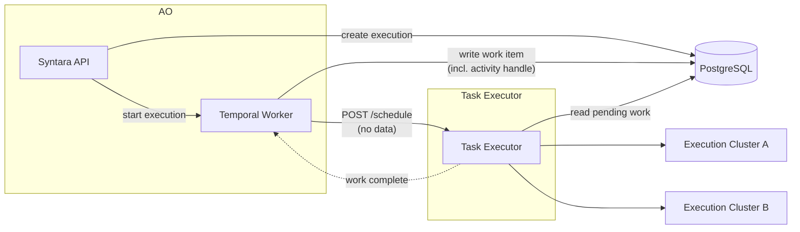
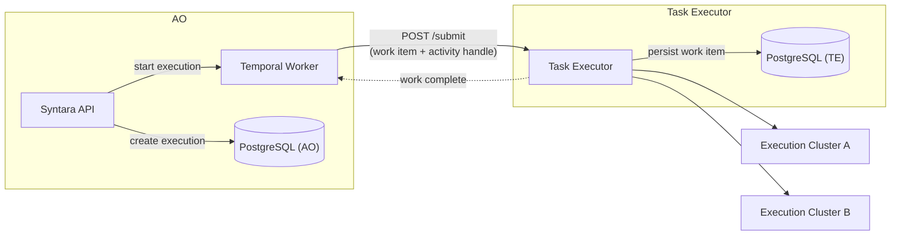

# Execution Plane — Key Design Decisions

[AAP-90685](https://redhat.atlassian.net/browse/AAP-90685) · Parent: [ANSTRAT-1803](https://redhat.atlassian.net/browse/ANSTRAT-1803)

Key architectural options — either still live, or designated as formally closed in this document. For implementation requirements see [execution-plane.md](execution-plane.md).

Each section states the options, the current working position, and what would change that position.

---

## D1: Scheduler topology

### Centralized Scheduler — nearly finalized

One Task Executor deployment holds the Work Store and owns all scheduling decisions: affinity routing, cross-cluster capacity balancing, back-pressure, and result persistence. The Task Executor is a separate service from Syntara API and Temporal Worker. Execution Clusters receive dispatch calls but do not make scheduling decisions.

#### Shared vs. split PostgreSQL

Note: "separate database" means a separate PostgreSQL *instance*, not a separate schema. A separate schema in the same instance is what both options use internally — see the `execution_plane` schema in the implementation. The question is whether that schema lives on the same instance as Syntara.

**Option A — Shared instance (current position)**

TE tables live in the `execution_plane` schema on the same PostgreSQL instance as Syntara. Temporal Worker writes the work item to `execution_plane.work_items` before calling `POST /schedule`. `/schedule` carries no data — it is a pure wakeup. TE polls the shared database for pending work.

Syntara API can also read `execution_plane.*` tables directly for the admin UI — no extra API hop.

**Option B — Separate TE instance**

TE has its own PostgreSQL instance. Temporal Worker cannot write to it directly. The work item must travel to TE via its API before TE can persist it. `POST /schedule` must carry the work item payload (or a separate `POST /submit` endpoint must exist). This changes the handoff protocol.

A separate instance could be shared with AAP if there is a requirement for AAP to read execution plane data directly at the database level.

**Working position:** Option A. Option B reintroduces a data-in-the-HTTP-call design that complicates idempotency and recovery. Shared instance with schema separation gives strong isolation without the protocol change.

**Open question:** Is there a proposal to give AAP direct database-level access to execution plane data? If yes, that is the only concrete reason to split the instance.

**Drawback:** Some backends (e.g. podman warm containers) would require the Task Executor to manage worker pool lifecycle directly, duplicating what OpenShell already does. We are not interested in those backends. The planned mitigation is a custom-service backend type — the TE dispatches to an operator-provided service that owns its own worker management (to be documented separately).

### Forward-Deployed Scheduler — definition

A forward-deployed scheduler is a scheduling component that runs inside the remote execution cluster, co-located with workers. It could handle local scheduling and dispatch operations close to the workers rather than making round-trips to the central Task Executor.

A forward-deployed scheduler is not mutually exclusive with the Centralized Scheduler. A future topology might have both: the central TE owns the Work Store and makes cross-cluster capacity decisions, while a forward-deployed component handles local dispatch operations on its cluster.

The forward-deployed scheduler concept could also revive if actions local to the execution cluster — such as worker management — turn out to be a poor fit for the TE's internal model and cannot be cleanly expressed as a backend type.

### Rejected: Temporal-to-Distributed Schedulers

AO requires a whole-service back-pressure queue — a durable Work Store that tracks capacity and queued work across all Execution Clusters. Temporal is a workflow engine; it is not the right abstraction for managing dispatch queues. Routing Temporal directly to per-cluster forward-deployed schedulers would make Temporal the back-pressure mechanism and leave no single owner for cross-cluster capacity decisions. This is rejected.

---

## AWX Integration

### The Task Executor as an API for AWX

AWX (Automation Controller) would use the Task Executor as an external API for dispatching execution work, rather than managing execution inline as it does today. AWX becomes a consumer of the TE's dispatch interface, the same role AO's Temporal Worker plays. This is analogous to how AAP 2.5 externalized authentication into a shared service — here, execution is the shared concern being externalized.

### Model morphism — open question

AWX has two relevant models: `InstanceGroup` (a logical grouping of nodes, used for job routing) and `Instance` (a physical execution node with capacity).

Two possible mappings, both under consideration:

| AWX model | Mapping option 1 | Mapping option 2 |
|---|---|---|
| InstanceGroup | → ExecutionTarget | → affinity label on ExecutionTarget |
| Instance | → (no direct equivalent) | → ExecutionTarget |

Option 1 treats an InstanceGroup as a pool (ExecutionTarget = a cluster or gateway). Option 2 treats individual nodes as targets and makes InstanceGroup a routing label. The right answer depends on the granularity at which AWX currently routes jobs and whether that maps to cluster-level or node-level targeting. This needs to be resolved before AWX integration can be designed.

### Compatibility and phased introduction

This is not backward API compatible. AWX's job dispatch today goes through the existing execution node mesh (receptor/workceptor). The TE is a different dispatch path.

Phased introduction is possible: some job types in Controller use the old mesh, others use the TE API. This allows incremental migration without a flag-day cutover, but requires Controller to maintain both paths during the transition.

### Changes required in Controller

- **DependencyManager**: unchanged — dependency resolution is independent of dispatch.
- **TaskManager**: split. The portion that manages job-to-node assignment moves toward the TE (affinity routing, capacity), but Controller retains blocking rules (e.g. only one job running for a single-JT at a time).
- **InstanceGroup and related models**: transferred to the TE service; Controller references them via TE API rather than local DB.
- **workceptor**: effectively unused — the TE dispatch path does not use receptor.
- **ExecutionEnvironment**: selected in Controller independently of InstanceGroup today. This is incompatible with the TE model, where the ExecutionProfile couples container image and placement. Resolution is needed — either EE selection moves into the TE, or the TE's ExecutionProfile model is made flexible enough to decouple image from placement.

---

## D2: OpenShell installation — who owns it?

**Question:** Does Syntara install and manage OpenShell, or does the operator install OpenShell independently and connect it to Syntara?

**Option A — Operator installs OpenShell (current position)**

OpenShell is installed by the platform operator as a day-2 operation (OLM, Helm, or manual). Syntara registers an Execution Target pointing at the OpenShell gRPC endpoint. Syntara does not manage the OpenShell lifecycle.

**Option B — In-app OpenShell provisioning**

Syntara's UI includes an "Install OpenShell" flow that drives installation onto a registered cluster. Syntara owns the OpenShell lifecycle.

**Working position:** Option A. In-app installation is installer-scale work (OLM integration, cluster admin privilege escalation, upgrade coordination) that is out of scope for Phase 2. Registering an already-installed OpenShell as an Execution Target is workable with no installer changes.

**PM question:** Is there a customer expectation that the AO installer handles OpenShell installation, or is day-2 manual connection acceptable?

---

## D3: OpenShell rollout — cold sandboxes before warm pools

**Question:** Should Phase 2 implement warm pools from the start, or prove OpenShell API compatibility with cold sandboxes first?

**Option A — Cold sandboxes first (current position)**

Phase 2 uses `CreateSandbox` + `ExecSandbox` per task. Each task incurs sandbox startup latency. No `SandboxWorkloadTemplate` or warm pool configuration required.

Rationale: Cold sandboxes exercise the full OpenShell dispatch path (gRPC stream, exit code handling, credential injection) with minimal moving parts. Warm pools add template lifecycle, readiness waiting, and `--max-burst` configuration complexity. Once cold dispatch works, warm pools are an additive change to the provisioning step.

**Option B — Warm pools from day one**

Implement `SandboxWorkloadTemplate` + `ClaimSandbox` in Phase 2. Accepts the additional complexity in exchange for acceptable latency from the start.

**Working position:** Option A. Startup latency is a performance issue, not a correctness issue. Proving the dispatch path is more valuable than optimizing it before it exists.

---

## D4: Container image management — user-driven vs. operator-configured

**Question:** Can a user register a new worker container image through the Syntara UI, and does that trigger pool bootstrapping?

**Option A — User-driven image registration**

The UI has a "Containers" tab where users (or operators) add OCI image references. Syntara handles pool bootstrapping when a new Container is registered. This implies Syntara owns the worker Deployment lifecycle and can create new pools on demand.

**Option B — Operator-configured (current position)**

Built-in container images ship with AO and are pre-registered. Custom images are registered by operators through configuration or API, not through a self-service UI flow. The UI shows registered Containers but does not expose a create/import flow to end users.

**Working position:** Option B for MVP. Option A requires Syntara to manage image pull secrets, Deployment rollout, and pool readiness — significant scope. Custom images are an operator concern.

**PM question:** Is there a customer use case where a non-operator user needs to register a custom container image at runtime without operator involvement?

---

## D5: Remote cluster scope — Phase 3 boundary

**Question:** Is multi-cluster execution (targets on remote OpenShift clusters or RHEL) in scope for Phase 1/2, or is it Phase 3?

**Current position:** Phase 1 and 2 are on-cluster only (Syntara and workers on the same cluster). Remote clusters are ANSTRAT-2337 scope.

**What's in scope at each phase:**

| Phase | Topology |
|---|---|
| 1 (MVP) | On-cluster vanilla K8S only |
| 2 | On-cluster OpenShell (cold sandboxes) |
| 3 | Warm pools; remote clusters via Pool Agent or OpenShell; installer integration TBD |

**PM question:** Do customers expect to register remote clusters from day one (Phase 1), or is on-cluster MVP sufficient for initial release?

---

## PM Feed-In Questions

These require PM input to resolve — engineering cannot answer them from architecture alone.

| # | Question | Why it matters |
|---|---|---|
| PM-1 | Is on-cluster-only MVP sufficient, or do customers expect remote clusters on day 1? | Determines Phase 1 scope and Pool Agent priority |
| PM-2 | Does AO need to install OpenShell, or is operator day-2 connection acceptable? | Determines whether installer-scope work is needed for Phase 2 |
| PM-3 | Is there a use case where non-operators register custom container images at runtime? | Determines whether self-service image registration is in scope |
| PM-4 | Is there a requirement to share execution plane data with AAP directly (database-level)? | Determines whether a separate execution plane database is needed |
| PM-5 | What customer data is available on which workflow activity types are most used? | Drives prioritization of which worker containers ship first |
| PM-6 | Is startup latency for OpenShell cold sandboxes acceptable for Phase 2, or is warm-pool performance a launch requirement? | Determines whether warm pools must be in Phase 2 |
