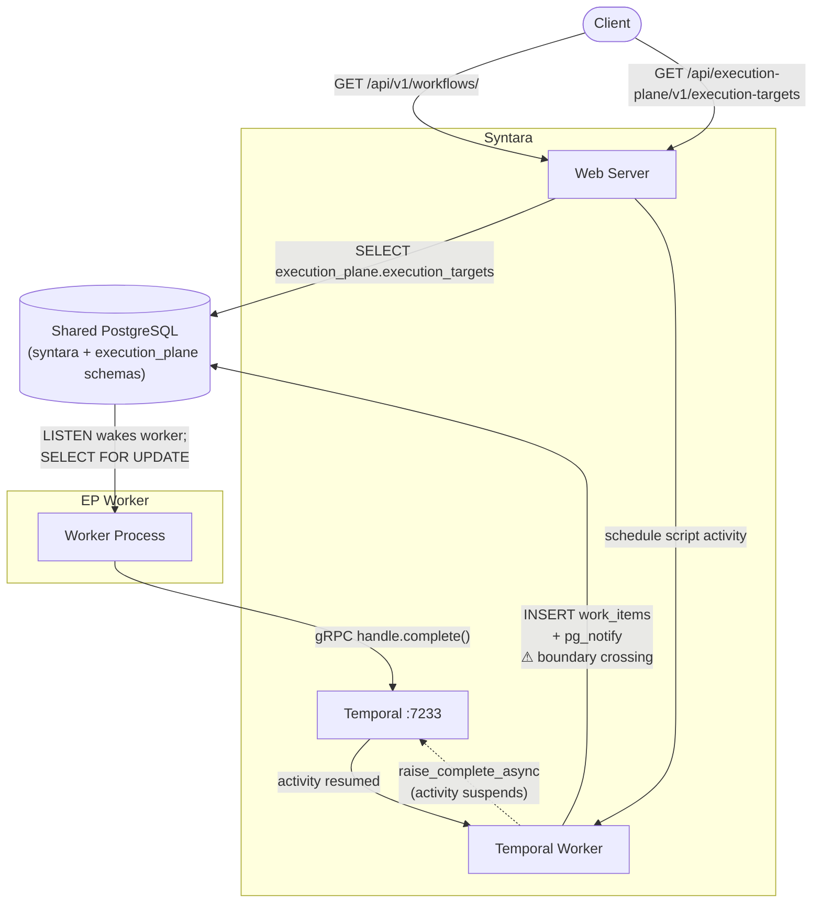
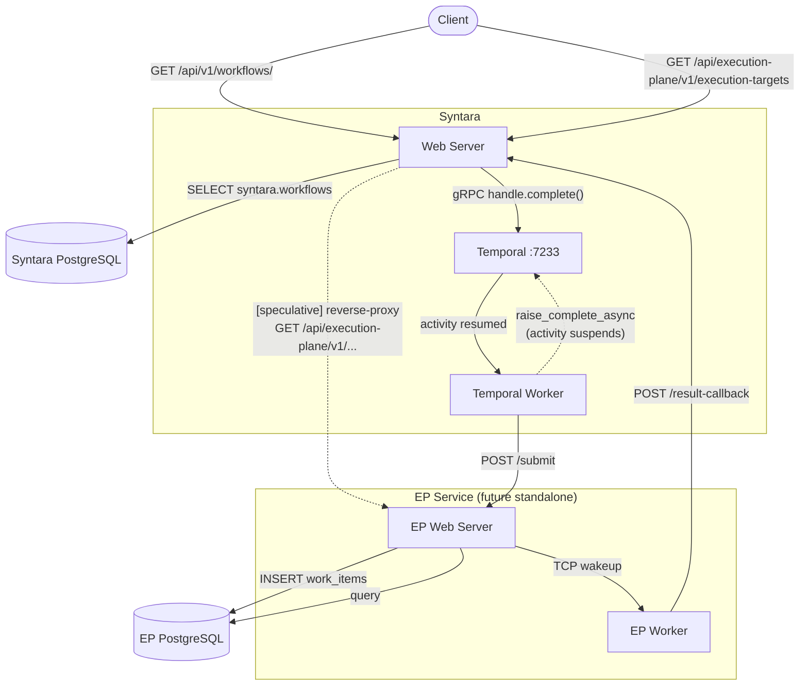

# Execution Plane: Current Integration and Future Service Boundary

## What this document is

A record of the deliberate shortcuts taken to ship the Execution Plane (EP)
worker without introducing a new HTTP service, and an explicit map of what
those shortcuts will become when the EP becomes standalone.

Every place in the codebase where Syntara directly touches the
`execution_plane` database schema carries a reference to this document. That
comment is a breadcrumb: if you are reading it, you have found a boundary
crossing that must be replaced before EP can run as an independent service.

---

## Architecture diagrams

### Current state

The EP router is temporarily mounted inside the Syntara web server. Work is
submitted by writing directly to the shared database rather than calling an API.



---

### Future state: EP as an independent service

The boxes below labelled **[speculative]** are not decided — the exact
mechanism for routing and auth is still open. The proxying path in particular
may be replaced by something entirely different (a separate subdomain, a
redirect, no public exposure of EP endpoints at all). The key point is that
`/api/execution-plane/` is a temporary path — it may move to a different path
or host when EP becomes a standalone service.



---

## Current state (intentional shortcut)

The EP worker is a separate Python package (`execution-plane/`) and runs in its
own container, but it shares the same PostgreSQL instance as Syntara. Rather
than calling an HTTP API, Syntara submits work by writing a `WorkItem` row
directly to the `execution_plane` schema and issuing a `pg_notify` on the
`execution_plane_work_items` channel.

```
Syntara Temporal worker
  └─ execute_script_activity
       └─ INSERT INTO execution_plane.work_items  ← boundary crossing
       └─ SELECT pg_notify(...)                   ← boundary crossing
           ↓
EP worker (separate container, same DB)
  └─ polls / wakes on NOTIFY
  └─ claims WorkItem, runs script
  └─ calls Temporal async completion callback
```

This is a conscious trade-off: it avoids operational complexity (service
discovery, inter-service auth, TLS, retry logic) at the cost of tight DB
coupling. The coupling is **bounded and explicit**:

- Syntara only **writes** to `execution_plane` schema tables. It never reads
  from them for business logic.
- The EP worker does not depend on the `syntara` package. It has no SQLModel
  models for Syntara's tables and no knowledge of Syntara's schema — it cannot
  touch them even accidentally.
- Syntara's Alembic autogenerate explicitly excludes the `execution_plane`
  schema (`migrations/env.py`), so migrations do not interfere.

Do not expand the set of boundary crossings. Any new write to the
`execution_plane` schema from Syntara code must be discussed and documented
here first.

---

## What the boundary crossings will become

When EP becomes a standalone HTTP service, each boundary crossing has a direct
replacement:

| Current (direct DB) | Future (HTTP API) |
|---|---|
| `INSERT INTO execution_plane.work_items` | `POST /submit` on the EP service |
| `SELECT pg_notify(...)` | removed — the EP service handles its own wakeup |

### The future `POST /submit` endpoint

The request body carries exactly what is currently written into the `WorkItem`
row:

```
POST /api/execution-plane/v1/submit

{
  "execution_id":    "<UUID of the Syntara workflow execution>",
  "activity_handle": "<base64 Temporal task token for async completion>",
  "payload": {
    "input_config":  { ... },   // language, code, environment, timeout
    "output_config": { ... }    // output mapping, if any
  }
}
```

The EP service creates the `WorkItem` row internally. The row becomes an
implementation detail of the EP service, not a shared contract with Syntara.

---

## Public API vs. internal submission API

The EP surface area has two distinct audiences:

**Internal submission** (`POST /submit`) — called by Syntara (and eventually
any orchestrator) to hand off work. This is a private interface between the
orchestrator and the EP service. It requires a trusted-caller auth mechanism
(service token, mTLS, network policy, or similar — TBD).

**Public operator API** — the endpoints already exposed through Syntara's
router: `GET /execution-targets`, `GET /work-items`. These let operators
observe EP state. They are part of the documented API surface today.

Whether the submission and public endpoints live on the same service, the same
port, or separate deployments is an open architecture decision reserved for the
team building the standalone EP service. This document does not resolve it.

**Temporal connectivity is a constraint on any standalone design.** The EP
worker currently calls `handle.complete()` — a direct gRPC call to the Temporal
Frontend service (port 7233) — to resume the suspended Syntara activity. This
means the EP worker pod requires egress to Temporal regardless of how work is
submitted to it. If a future design needs the EP worker to be fully isolated
from Temporal (e.g. in a stricter network segment), the completion signal must
travel back to Syntara via a callback endpoint instead: the EP worker `POST`s
the result to a Syntara API endpoint, and Syntara calls `handle.complete()`.
That callback URL and its auth mechanism would become part of the `POST /submit`
request body sent by Syntara when submitting work.

---

## Current boundary crossings (exhaustive list)

These are the only places where Syntara code directly touches the
`execution_plane` schema. Each one must be replaced when EP becomes standalone.

| File | What it does |
|---|---|
| `src/syntara/workflows/workflow_engine/activities/ep/ep_dispatch_activity.py` | Writes `WorkItem` row and issues `pg_notify` |

The EP router (`execution_plane/router.py`) is imported and mounted in
`src/syntara/api/main.py`. This is a different category of coupling — it is
the public API surface being temporarily hosted by Syntara rather than the EP
service. That import also moves out when EP becomes standalone.

---

## What not to add

- Do not add Syntara code that **reads** from `execution_plane` schema tables.
- Do not add Syntara code that **joins** `execution_plane` tables with Syntara
  tables in a single query.
- Do not add new `execution_plane` schema writes from Syntara without updating
  this document and the boundary-crossing comment table above.
