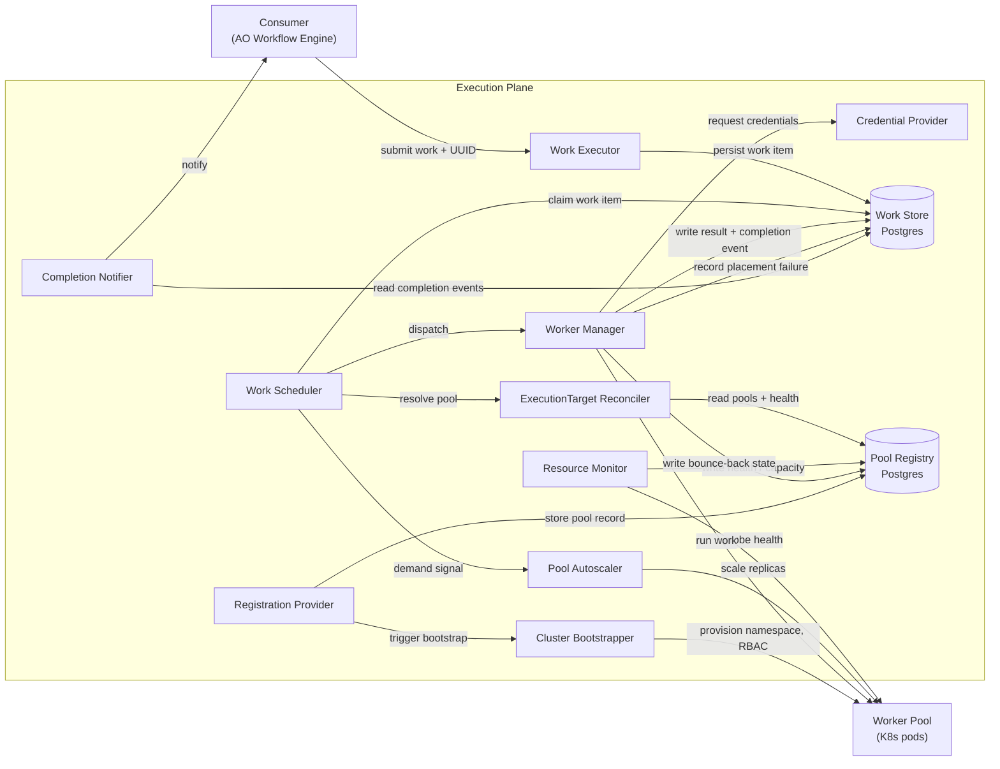
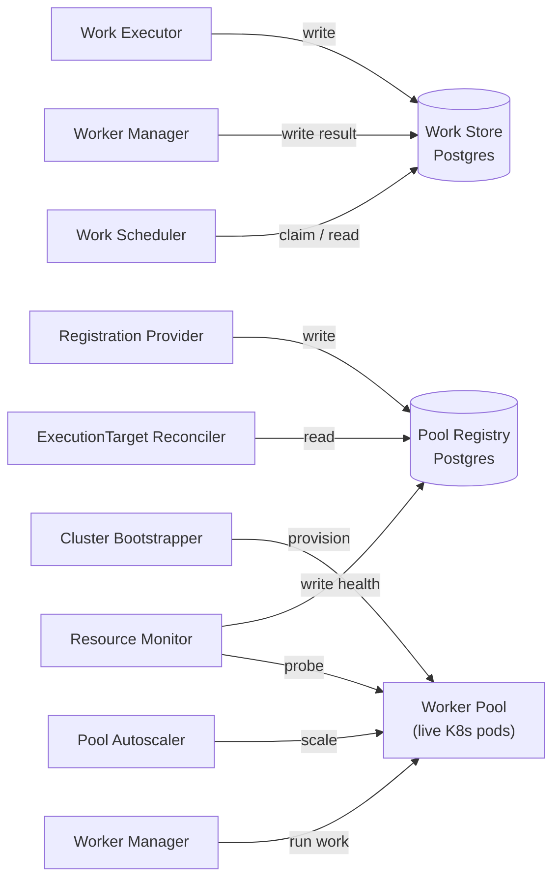

# Execution Plane: Logical Components

This is an echo of the component decomposition from the ANSTRAT-1803 System Design Plan:
[ansible/handbook#1664](https://github.com/ansible/handbook/pull/1664). Refer to that
document for the authoritative component definitions, acceptance criteria, and
requirements. Notes here reflect implementation-level detail and decisions made after
the SDP was written.

---

## Component interactions

---

## Logical units

- **[Work Executor](work-executor.md)** — In: work submission from consumer, including a
  caller-generated UUID and isolation policy. Out: work item persisted to Work Store. The
  ID is caller-owned — the consumer generates it before submitting.

- **[Work Store](work-store.md)** — In: work items (Executor); results and completion
  events (Worker Manager). Out: claimable queue (Scheduler); completion events
  (Completion Notifier).

- **Work Scheduler** — In: claimed work item from Work Store; ReconcileResult from Pool
  Reconciler. Out: dispatch to Worker Manager; demand signal to Pool Autoscaler.

- **ExecutionTarget Reconciler** — In: WorkRequirements (selectors, isolation policy) from
  Scheduler; pool snapshots + health from Pool Registry. Out: ranked ReconcileResult
  (selected pool, ineligible pools with reasons). Pure query — no writes, no side
  effects.

- **Pool Registry** — In: pool registrations from Registration Provider; health and
  capacity updates from Resource Monitor. Out: pool snapshots to ExecutionTarget Reconciler.
  Currently the `ExecutionTarget` table in Postgres.

- **Resource Monitor** — In: health probes from Worker Pool. Out: writes health and
  capacity back to Pool Registry. No state of its own.

- **Pool Autoscaler** — In: demand signal from Scheduler. Out: replica count adjustment
  to Worker Pool.

- **[Worker Manager](worker-manager.md)** — In: work item + pool context from Scheduler.
  Out: result and completion event written to Work Store; bounce-back state written to
  Pool Registry on K8s rejection. Acquires a worker, injects credentials, runs the work,
  collects output.

- **Credential Provider** — In: credential scope (from isolation policy on the work item
  or the ExecutionTarget) + request from Worker Manager. Out: credentials injected into
  the worker for the duration of execution only.

- **Worker Pool** — In: work dispatched by Worker Manager; scale adjustments from
  Autoscaler; bootstrap from Cluster Bootstrapper. Out: execution results; health data
  probed by Resource Monitor. K8s backend: see [kubernetes-backend.md](kubernetes-backend.md).

- **Completion Notifier** — In: completion event from Work Store. Out: async notification
  to consumer (e.g. Temporal signal callback).

- **Registration Provider** — In: administrator registration action. Out: pool record
  written to Pool Registry; bootstrap delegated to Cluster Bootstrapper.

- **Cluster Bootstrapper** — In: registration from Registration Provider. Out:
  provisioned K8s resources (namespace, ServiceAccount, RBAC) that become the Worker
  Pool.

---

## State holders

The two durable data stores are both Postgres. Worker Pool is live infrastructure state
held by K8s, not a database.

| Store | What it holds | Technology |
|---|---|---|
| Work Store | Work items, results, completion events, signaled_at | Postgres |
| Pool Registry | Pool records, lifecycle status, health, capacity | Postgres (currently `ExecutionTarget`) |
| Worker Pool | Running pods, replica state | Kubernetes |
